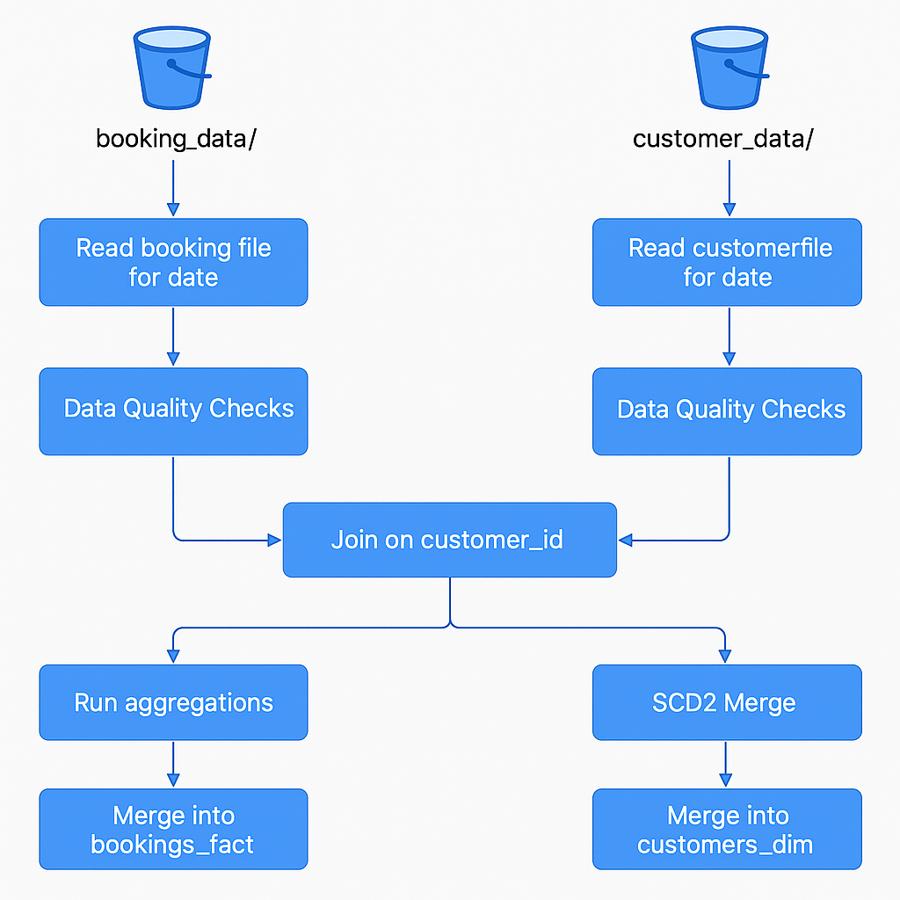

# Travel Bookings Data Ingestion Pipeline With SCD2 Merge

## Introduction
This project demonstrates how to build a scalable and production-oriented data ingestion pipeline for travel booking data using Delta Lake, PySpark, and Databricks. It incorporates SCD2 (Slowly Changing Dimension Type 2) merge logic and data quality checks using PyDeequ, ensuring historical accuracy and data trust for reporting and analysis.

## Problem Statement
Modern data systems require not just ingestion of transactional data but also a robust mechanism to check quality of data and to track historical changes in dimension data. This project addresses the challenge of maintaining a reliable fact-dimension model with maintaining complete historical records of customer dimension data and real-time booking aggregations. It simulates a realistic use case in the travel industry where customer and booking data changes daily and needs to be ingested incrementally, quality-checked, and merged efficiently.

## Architecture
The pipeline reads daily CSV files from Google Cloud Storage (GCS), performs data validation with PyDeequ, runs aggregations on booking data, and performs SCD2 merge on customer data. 

## Technology Used
- Python
- PySpark
- Databricks
- Delta Lake
- Google Cloud Storage (GCS)
- Databricks Workflows
- PyDeequ

## Dataset Used
#### Input Data
- `booking_data.csv`: booking_id, customer_id, booking_date, amount, booking_type, quantity, discount, booking_status, hotel_name, flight_number
- `customer_data.csv`: customer_id, customer_name, customer_address, phone_number, email, valid_from, valid_to

#### Output Tables
- bookings_fact: customer_id, total_amount_sum, total_quantity_sum
- customers_dim: customer_id, customer_name, customer_address, phone_number, email, valid_from, valid_to, is_current, ingestion_timestamp

## Scripts for Project
#### Travel_Booking_SCD2_Merge.ipynb:
Main notebook that:
- Dynamically reads daily booking and customer files based on a user-supplied `arrival_date` parameter.
- Runs PyDeequ data quality checks on both dataframes.
- Stops or proceeds based on quality check results.
- Joins bookings and customers on customer_id.
- By performing aggregations on that joined data we derive columns like total_amount_sum and total_quantity_sum and merges results into the bookings_fact Delta table.
- Applies SCD2 merge logic on the customers_dim table using Delta Lake's MERGE command.

- workflow_in_json.json: This file is automatically generated by Databricks when we create or export a job (workflow). It contains the full configuration of Databricks Workflow in JSON format.

## Output and Impact
- Aggregated booking metrics such as total_amount_sum and total_quantity_sum are updated daily in the bookings_fact table.
- The customers_dim table maintains complete historical records of customer data changes using SCD2 logic.
- Data quality issues are flagged early using automated checks, improving data trustworthiness.
- Dynamic date parameterization enables the pipeline to scale across any ingestion schedule (manual or automated).
- Databricks Workflows allow seamless scheduling with input parameter support.

## My Learnings
- Implementation of Slowly Changing Dimension Type 2 logic using Delta Lake's merge syntax.
- Real-world data checks and validation using PyDeequ and converting check results to filterable DataFrames to see which checks passed or failed.
- File ingestion based on user input (or defaulting to current date).
- Workflow scheduling in Databricks with parameterized notebooks for flexible automation.

